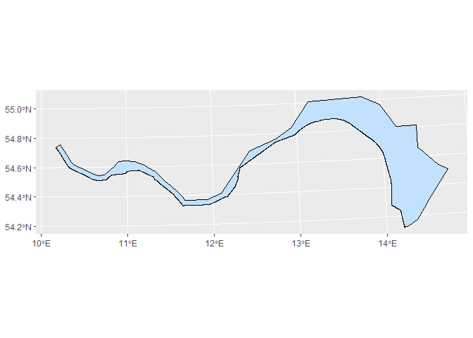
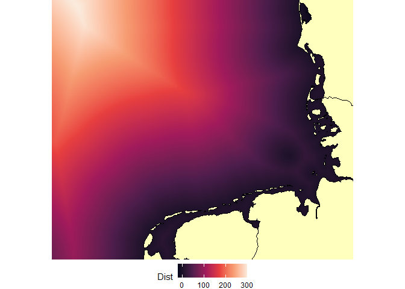
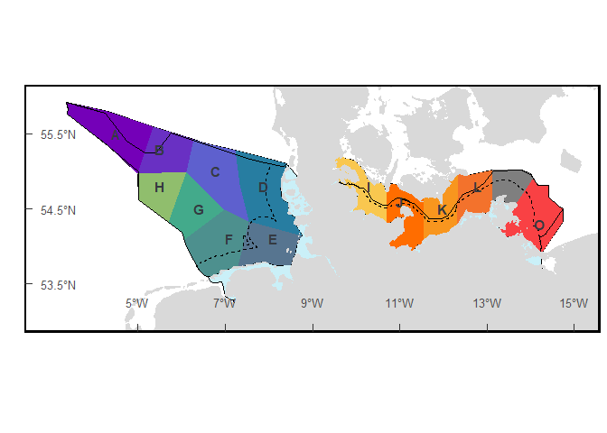
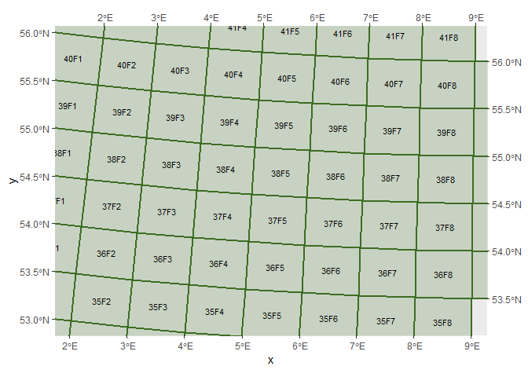
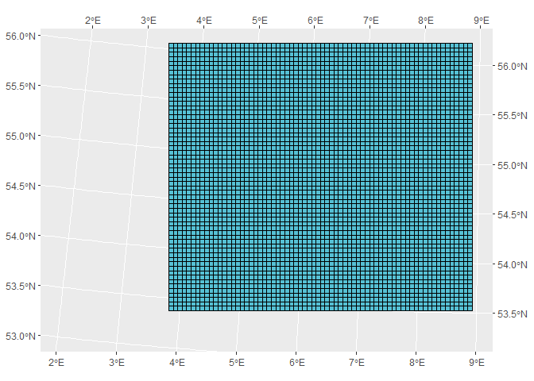

<!-- README.md is generated from README.Rmd. Please edit that file -->

# German North Sea

This package contains shapefiles from the **German Seas**: <br>

- [Natura2000](https://www.eea.europa.eu/data-and-maps/data/natura-13/natura-2000-spatial-data/natura-2000-shapefile-1)<br>
- [Country shape](https://www.diva-gis.org/datadown)<br>
- [Economic Exclusive
  zone](https://marineregions.org/gazetteer.php?p=details&id=5669)<br>
- [ICES
  rectangles](https://gis.ices.dk/shapefiles/ICES_rectangles.zip)<br>

The goal is provide easy access to shapefiles of the German Seas.

Mostly focused on German North Sea, but also supports some for Baltic
Sea.

Shapefiles are in CRS 3035, and 4326.

# 1. Installation

``` r
# install.packages("devtools")
devtools::install_github("MiriamLL/GermanNorthSea")
```

``` r
library(GermanNorthSea)
```

# 2. Map

## 2.1. Europe

``` r
German_land<-GermanNorthSea::German_land
```

``` r
ggplot2::ggplot()+ ggplot2::geom_sf(data = German_land, colour = 'black', fill = '#ffffbe')+
  ggplot2::coord_sf(xlim = c(3790000,4250000), ylim = c(3350000,3680000),
                    label_axes = list(top = "E", left = "N", bottom = 'E', right='N'))
```


## 2.2. Germany

To download go to: [DIVA-GIS](https://www.diva-gis.org/datadown)<br>
Select the country and Administrative areas.

``` r
Germany<-GermanNorthSea::Germany
```

``` r
ggplot2::ggplot()+ ggplot2::geom_sf(data = Germany, colour = 'black', fill = '#ffffbe')+
  ggplot2::coord_sf(xlim = c(3790000,4250000), ylim = c(3350000,3680000),
                    label_axes = list(top = "E", left = "N", bottom = 'E', right='N'))
```


## 2.3. German EEZ

To download: go to
[EMODnet](https://www.emodnet-humanactivities.eu/view-data.php)\>Select
wind farms in the map. Select Other Forms of Area
Management/Designation\>Click on the download icon on [Exclusive
Economic
Zone](https://www.emodnet-humanactivities.eu/search-results.php?dataname=Exclusive+Economic+Zone).
Select Download Data, Select the country, and the Sector, and the Link
should be ready to download.

``` r
German_EEZ<-GermanNorthSea::German_EEZ
```

``` r
ggplot2::ggplot()+ ggplot2::geom_sf(data = German_EEZ,
                                    colour = "red", fill= NA,alpha=0.9, lwd = 1)+
  ggplot2::coord_sf(xlim = c(3790000,4250000), ylim = c(3350000,3680000),
                    label_axes = list(top = "E", left = "N", bottom = 'E', right='N'))
```


## 2.4. German EEZ coast

``` r
German_coast<-GermanNorthSea::German_coast
```

``` r
ggplot2::ggplot()+ 
  ggplot2::geom_sf(data = German_coast, 
                                    colour = "red", fill= '#bde0fe',alpha=0.9, lwd = 1,linetype="dashed")+
  ggplot2::coord_sf(xlim = c(3790000,4250000), ylim = c(3350000,3680000),
                    label_axes = list(top = "E", left = "N", bottom = 'E', right='N'))
```


## 2.5. EEZ North

``` r
EEZ_North<-GermanNorthSea::EEZ_North
```

``` r
ggplot2::ggplot()+ 
  ggplot2::geom_sf(data = EEZ_North, 
                                    colour = "black", fill= '#bde0fe',alpha=0.9, lwd = 0.5)+
  ggplot2::coord_sf(xlim = c(3790000,4250000), ylim = c(3350000,3680000),
                    label_axes = list(top = "E", left = "N", bottom = 'E', right='N'))
```


## 2.6. EEZ Baltic

``` r
EEZ_Baltic<-GermanNorthSea::EEZ_Baltic
```

``` r
ggplot2::ggplot()+ 
  ggplot2::geom_sf(data = EEZ_Baltic, 
                                    colour = "black", fill= '#bde0fe',alpha=0.9, lwd = 0.5)
```



# 3. Protected areas

### 3.1. Natura Areas

To download: go to
[GeoSeaPortal](https://www.geoseaportal.de/atomfeeds/Raumordnungsplan_AWZ_en.xml#download=1.)
The zip contains several shapefiles including **NatureConservation**

Other option is
[eea](https://www.eea.europa.eu/data-and-maps/data/natura-13)

``` r
German_natura<-GermanNorthSea::German_natura
```

``` r
ggplot2::ggplot()+ 
  ggplot2::geom_sf(data = German_natura, colour = "#3d6d22", fill= '#3d6d22',alpha=0.2, lwd = 1)+
  ggplot2::coord_sf(xlim = c(3790000,4250000), ylim = c(3350000,3680000),
                    label_axes = list(top = "E", left = "N", bottom = 'E', right='N'))
```


### 3.2. Special Conservation Areas

Other option is [Europen Environment
Agency](https://www.eea.europa.eu/data-and-maps/data/natura-14) This
file contains a more complete data from the natura 2000 sites.

For using the SCA (Special Conservation Areas) in Germany

``` r
German_SCA<-GermanNorthSea::German_SCA
```

``` r
ggplot2::ggplot()+ 
  ggplot2::geom_sf(data = German_SCA, colour = "#3d6d22", fill= '#3d6d22',alpha=0.2, lwd = 1)+
  ggplot2::coord_sf(xlim = c(3790000,4250000), ylim = c(3350000,3680000),
                    label_axes = list(top = "E", left = "N", bottom = 'E', right='N'))
```


### 3.3. SPA and SCA

``` r
ggplot2::ggplot()+ 
  ggplot2::geom_sf(data = German_natura, colour = "#3d6d22", fill= '#3d6d22',alpha=0.2, lwd = 1)+
  ggplot2::geom_sf(data = German_SCA, colour = "#3d6d22", fill= '#3d6d22',alpha=0.2, lwd = 1)+
  ggplot2::coord_sf(xlim = c(3790000,4250000), ylim = c(3350000,3680000),
                    label_axes = list(top = "E", left = "N", bottom = 'E', right='N'))
```


# 4. Human activities

## 4.1. Shipping lines

To download: go to
[GeoSeaPortal](https://www.geoseaportal.de/atomfeeds/Raumordnungsplan_AWZ_en.xml#download=1.)
The zip contains several shapefiles including **Shipping**

``` r
German_Shipping<-GermanNorthSea::German_Shipping
```

``` r
ggplot2::ggplot()+ 
  ggplot2::geom_sf(data = German_Shipping, colour = "blue", fill= 'blue',alpha=0.2, lwd = 1)+
  ggplot2::coord_sf(xlim = c(3790000,4250000), ylim = c(3350000,3680000),
                    label_axes = list(top = "E", left = "N", bottom = 'E', right='N'))
```


## 4.2. Wind Farms

### 4.2.1. BfN

To download: go to
[GeoSeaPortal](https://www.geoseaportal.de/atomfeeds/Raumordnungsplan_AWZ_en.xml#download=1.)
The zip contains several shapefiles including **‘OffshoreWindEnergy’**

``` r
German_OWF<-GermanNorthSea::German_OWF
```

``` r
ggplot2::ggplot()+ 
  ggplot2::geom_sf(data = German_OWF, colour = "#fe0001", fill= '#bde0fe',alpha=0.9, size=1)+
  ggplot2::coord_sf(xlim = c(3790000,4250000), ylim = c(3350000,3680000),
                    label_axes = list(top = "E", left = "N", bottom = 'E', right='N'))
```


### 4.2.2. EMODnet

To download: Go to
[EMBO](https://www.emodnet-humanactivities.eu/view-data.php). Select
[human
activities](https://www.emodnet-humanactivities.eu/search-results.php?dataname=Wind+Farms+%28Polygons%29)

``` r
OWF_EMODnet<-GermanNorthSea::OWF_EMODnet
```

``` r
ggplot2::ggplot()+ 
  ggplot2::geom_sf(data = OWF_EMODnet, colour = "#fe0001", fill= '#bde0fe',alpha=0.9, size=1)+
  ggplot2::coord_sf(xlim = c(3790000,4250000), ylim = c(3350000,3680000),
                    label_axes = list(top = "E", left = "N", bottom = 'E', right='N'))
```


# 5. Environmental variables

## 5.1. Bathymetry

To download [GEBCO: General Bathymetry Chart of the
Oceans](https://www.gebco.net/data_and_products/gridded_bathymetry_data/#area)

Go to: [Download](https://download.gebco.net/) data for user-defined
areas Use the application. Add your coordinates here I use 1 to 10 and
50 to 60. Add to basket and download.

For steps to manipulate the data check my
[blogpost](https://www.miriam-lerma.com/posts/2025-01-15-bathymetry/)

Reference: If the data sets are used in a presentation or publication
then we ask that you acknowledge the source.This should be of the form:
GEBCO Compilation Group (2024) GEBCO 2024 Grid
(<doi:10.5285/1c44ce99-0a0d-5f4f-e063-7086abc0ea0f>)

``` r
Bath_dataframe<-GermanNorthSea::German_bath
```

``` r
library(tidyverse)
Bath_dataframe_sub <-Bath_dataframe  %>%
  filter(x > 2 & x < 10)%>%
  filter(y > 52 & y < 57)%>%
  rename(Bathymetry=3) %>%
  filter(Bathymetry < 10)%>%
  mutate(Bathymetry = as.numeric(Bathymetry))
```

``` r
library(sf)
#> Linking to GEOS 3.12.1, GDAL 3.8.4, PROJ 9.3.1; sf_use_s2() is TRUE
German_land<-st_transform(German_land, 4326)
```

``` r
library(ggplot2)
ggplot() +
  geom_raster(data = Bath_dataframe_sub , aes(x = x, y = y, fill = Bathymetry)) +
  geom_sf(data = German_land, colour = 'black', fill = '#ffffbe')+
  scale_fill_viridis_c(option = "mako")+
  theme_void()+
  theme(legend.position='bottom')+
  xlab('Longitude')+ylab('Latitude')+
  coord_sf(xlim = c(3,9), ylim = c(53,56),
                    label_axes = list(top = "E", left = "N", bottom = 'E', right='N'))
```


Reference: If the data sets are used in a presentation or publication
then we ask that you acknowledge the source.This should be of the form:
GEBCO Compilation Group (2024) GEBCO 2024 Grid
(<doi:10.5285/1c44ce99-0a0d-5f4f-e063-7086abc0ea0f>)

## 5.2. Distance to coast

Source: [OceanColor
NASA](https://oceancolor.gsfc.nasa.gov/resources/docs/distfromcoast/) I
recommend to download **the interpolated 0.01-degree GeoTiff packed
together with a brief description file.** For steps to manipulate the
data check my
[blogpost](https://www.miriam-lerma.com/posts/2025-02-15-distancetocoast/)

``` r
DistCoast_dataframe<-GermanNorthSea::German_distancecoast
```

``` r
library(sf)
```

``` r
German_land<-st_transform(GermanNorthSea::German_land, 4326)
```

``` r
DistCoast_dataframe_sub<-DistCoast_dataframe %>%
  filter(Dist > -20)
```

``` r
ggplot() +
  geom_raster(data = DistCoast_dataframe_sub, aes(x = x, y = y, fill = Dist)) +
  geom_sf(data = German_land, colour = 'black', fill = '#ffffbe')+
  scale_fill_viridis_c(option = "rocket")+
  theme_void()+
  theme(legend.position='bottom')+
  xlab('Longitude')+ylab('Latitude')+
  coord_sf(xlim = c(3,9), ylim = c(53,56),
                    label_axes = list(top = "E", left = "N", bottom = 'E', right='N'))
```



# 6. Zonification

## 6.1. Study Area

Based on the occurrence of marine animals, the sea areas of the German
North Sea and Baltic Sea were divided into study areas, which were then
surveyed using specific transect designs.

Source:
[BfN](https://nokis.mdi-de-dienste.org/trefferanzeige?docuuid=57fbad61-2960-4fe1-bd28-291894d02c94)

Reference: Dieser Dienst und die darin verfügbaren Daten können gemäß
der ‘Nutzungsbestimmungen für die Bereitstellung von Geodaten des
Bundes’
(<http://www.gesetze-im-internet.de/bundesrecht/geonutzv/gesamt.pdf>)
genutzt werden. Quelle: Bundesamt für Naturschutz (BfN) Jahr.

``` r
Study_areas<-GermanNorthSea::Study_areas
```

``` r
library(ggplot2)
German_land<-st_transform(GermanNorthSea::German_land, 4326)
German_EEZ<-st_transform(GermanNorthSea::German_EEZ, 4326)
German_coast<-st_transform(GermanNorthSea::German_coast, 4326)
ggplot() +  
   geom_sf(data = German_EEZ, colour = "black", fill= '#caf0f8', lwd = 0.5)+
  
  geom_sf(data = Study_areas, color='black',fill = '#caf0f8', lwd = 0.5)+
  
  geom_sf(data = Study_areas, aes(fill=stratum),colour = 'transparent')+
  scale_fill_manual(values = c(A = '#7400b8',B = '#6930c3',C = '#5e60ce',D = '#277da1',E = '#577590',F = '#4d908e',
                               G = '#43aa8b',H = '#90be6d',I = '#f9c74f',J = '#ff6d00',K = '#f8961e',L = '#f3722c',
                               N = '#f94144'))+
  
  # Fill colors
 
 
  # Line colors
  geom_sf(data = German_EEZ, colour = "black", fill= NA, lwd = 0.5)+
  geom_sf(data = German_coast, colour = "black", fill= NA,alpha=0.9, lwd = 0.5,linetype="dashed")+
  geom_sf(data = German_land, colour = '#d9d9d9', fill = '#d9d9d9')+
  
  geom_sf(data = German_coast, colour = "black", fill= NA,alpha=0.9, lwd = 0.5,linetype="dashed")+
  
  coord_sf(xlim = c(3, 15),ylim = c(53, 56))+
  scale_x_continuous(breaks = c(5,7,9,11,13,15),labels = function(x) paste0(x, '\u00B0', "W")) +
  scale_y_continuous(breaks = c(53.5,54.5,55.5,56.5),labels = function(x) paste0(x, '\u00B0', "N"))+
  
  theme(
  legend.position='none',
  legend.spacing.y = unit(0.05, 'cm'),
  legend.text=element_text(size=10),
  legend.background = element_rect(fill='transparent',colour ="transparent"),
  legend.box.background = element_rect(fill='transparent',colour ="transparent"),
  legend.key = element_rect(fill = "transparent", colour = "transparent"),
  panel.grid.major = element_blank(),
  panel.grid.minor = element_blank(),
  panel.background = element_rect(fill = "transparent"))+
  
  xlab('Longitude')+ylab('Latitude')+
  
  theme(panel.border = element_rect(colour = "black", fill=NA, size=1.5))+
  
  theme(axis.text.x = element_text(size=10,vjust = 15),
        axis.text.y = element_text(size=10,margin = margin(0,-1.50,0,1, unit = 'cm')),
        axis.title = element_blank(),
        axis.ticks.length=unit(-0.25, "cm"))+
  annotate(geom = "text", x = 4.5, y = 55.5, label = "A",size = 4,fontface = 'bold',color='#343a40')+
  annotate(geom = "text", x = 5.5, y = 55.3, label = "B",size = 4,fontface = 'bold',color='#343a40')+
  annotate(geom = "text", x = 6.8, y = 55.0, label = "C",size = 4,fontface = 'bold',color='#343a40')+
  annotate(geom = "text", x = 7.9, y = 54.8, label = "D",size = 4,fontface = 'bold',color='#343a40')+
  annotate(geom = "text", x = 8.1, y = 54.1, label = "E",size = 4,fontface = 'bold',color='#343a40')+
  annotate(geom = "text", x = 7.1, y = 54.1, label = "F",size = 4,fontface = 'bold',color='#343a40')+
  annotate(geom = "text", x = 6.4, y = 54.5, label = "G",size = 4,fontface = 'bold',color='#343a40')+
  annotate(geom = "text", x = 5.5, y = 54.8, label = "H",size = 4,fontface = 'bold',color='#343a40')+  
  annotate(geom = "text", x = 10.3,y = 54.8, label = "I",size = 4,fontface = 'bold',color='#343a40')+
  annotate(geom = "text", x = 11,  y = 54.6, label = "J",size = 4,fontface = 'bold',color='#343a40')+
  annotate(geom = "text", x = 12,  y = 54.5, label = "K",size = 4,fontface = 'bold',color='#343a40')+
  annotate(geom = "text", x = 12.8,y = 54.8, label = "L",size = 4,fontface = 'bold',color='#343a40')+
  annotate(geom = "text", x = 14.2,y = 54.3, label = "O",size = 4,fontface = 'bold',color='#343a40')
#> Warning: The `size` argument of `element_rect()` is deprecated as of ggplot2 3.4.0.
#> ℹ Please use the `linewidth` argument instead.
#> This warning is displayed once every 8 hours.
#> Call `lifecycle::last_lifecycle_warnings()` to see where this warning was
#> generated.
```



## 6.2. ICES Rectangles

Source: [ICES rectangles](https://gis.ices.dk/sf/index.html)<br> To
download: go to link\> click on **Quick Downloads**\> select ICES
Statistical Rectangles.

``` r
German_ICES<-GermanNorthSea::German_ICES
```

``` r
ggplot2::ggplot(German_ICES)+ 
  ggplot2::geom_sf(data = German_ICES, colour = "#3d6d22", fill= '#3d6d22',alpha=0.2, lwd = 1)+
  ggplot2::geom_sf_text(ggplot2::aes(label =ICESNAME),size=3,family="sans")+
  ggplot2::coord_sf(xlim = c(3790000,4250000), ylim = c(3350000,3680000),
                    label_axes = list(top = "E", left = "N", bottom = 'E', right='N'))
```



## 6.3. Grids

This grids were created in R and are made available by this package.

To cite: Lerma, M (2023) German North Sea package.

``` r
library(ggplot2)
library(ggspatial)
```

### 6.3.1. Grid 5x5

``` r
library(GermanNorthSea)
```

``` r
grid5x5_3035<-grid5x5_3035
```

``` r
ggplot2::ggplot()+ 
  ggplot2::geom_sf(data=grid5x5_3035, colour = "black", fill= '#56C1D5', lwd = 0.5)+
  ggplot2::coord_sf(xlim = c(3790000,4250000), ylim = c(3350000,3680000),
                    label_axes = list(top = "E", left = "N", bottom = 'E', right='N'))
```



### 6.3.2. Grid 10x10

``` r
grid10x10_3035<-grid10x10_3035
```

``` r
ggplot2::ggplot()+ 
  ggplot2::geom_sf(data=grid10x10_3035, colour = "black", fill= '#56C1D5', lwd = 0.5)+
  ggplot2::coord_sf(xlim = c(3790000,4250000), ylim = c(3350000,3680000),
                    label_axes = list(top = "E", left = "N", bottom = 'E', right='N'))
```


``` r
ggplot() +
  geom_sf(data = GermanNorthSea::German_EEZ, colour = "red", fill= NA,alpha=0.9, lwd = 0.5)+
  geom_sf(data = GermanNorthSea::German_coast, colour = "red", fill= NA,alpha=0.9, lwd = 0.5,linetype="dashed")+
  geom_sf(data = GermanNorthSea::German_land, colour = 'black', fill = '#ffffbe')+
  ggplot2::geom_sf(data=grid10x10_3035, colour = "black", fill= '#56C1D5', lwd = 0.5, alpha=0.1)+
    xlab('Longitude')+ylab('Latitude')+
  
  theme(panel.border = element_rect(colour = "black", fill=NA, size=1.5))+
  
  coord_sf(xlim = c(3900000,4250000), ylim = c(3350000,3680000),
                    label_axes = list(top = "E", left = "N", bottom = 'E', right='N'))
```


### 6.3.3. Grid 10x10 Only EEZ

``` r
grid10x10_EEZ<-grid10x10_EEZ
```

``` r
ggplot2::ggplot()+ 
  ggplot2::geom_sf(data=grid10x10_EEZ, colour = "black", fill= '#56C1D5', lwd = 0.5)+
  ggplot2::coord_sf(xlim = c(3790000,4250000), ylim = c(3350000,3680000),
                    label_axes = list(top = "E", left = "N", bottom = 'E', right='N'))
```


# 7. Maps with annotations

``` r
library(ggplot2)
library(ggspatial)
```

## 7.1. CRS 3050

``` r
German_land<-GermanNorthSea::German_land
German_EEZ<-GermanNorthSea::German_EEZ
German_coast<-GermanNorthSea::German_coast
```

``` r
ggplot() +
  geom_sf(data = German_EEZ, colour = "red", fill= NA,alpha=0.9, lwd = 0.5)+
  geom_sf(data = German_coast, colour = "red", fill= NA,alpha=0.9, lwd = 0.5,linetype="dashed")+
  geom_sf(data = German_land, colour = 'black', fill = '#ffffbe')+

  annotation_north_arrow(location ="bl", which_north = "true", 
        pad_x = unit(0.05, "in"), 
        pad_y = unit(0.05, "in"),
        
        style = north_arrow_fancy_orienteering)+
  
  theme(
  legend.spacing.y = unit(0.05, 'cm'),
  legend.text=element_text(size=10),
  legend.background = element_rect(fill='transparent',colour ="transparent"),
  legend.box.background = element_rect(fill='transparent',colour ="transparent"),
  legend.key = element_rect(fill = "transparent", colour = "transparent"),
  panel.background = element_rect(fill = '#bde0fe'))+
  
  xlab('Longitude')+ylab('Latitude')+
  
  theme(panel.border = element_rect(colour = "black", fill=NA, size=1.5))+
  
  coord_sf(xlim = c(3900000,4250000), ylim = c(3350000,3680000),
                    label_axes = list(top = "E", left = "N", bottom = 'E', right='N'))
```


### 7.1.1. ICES rectangles

``` r
library(tidyverse)
```

``` r
German_ICES<-GermanNorthSea::German_ICES
```

``` r
ICES_rectangles<-German_ICES %>%
  filter(ICESNAME %in% c('40F3','40F4',
                         '39F4','39F5','39F6','39F7','39F8',
                         '38F5','38F6','38F7','38F8',
                         '37F5','37F6','37F7','37F8',
                         '36F6','36F7','36F8'))
```

``` r
ggplot(ICES_rectangles)+ 
  geom_sf(data = ICES_rectangles, colour = "#14213d", fill= NA, alpha=0.2, lwd = 0.1)+
  geom_sf_text(aes(label=ICESNAME),size=3,family="sans")+

  geom_sf(data = German_EEZ, colour = "red", fill= NA,alpha=0.9, lwd = 0.5)+
  geom_sf(data = German_coast, colour = "red", fill= NA,alpha=0.9, lwd = 0.5,linetype="dashed")+
  geom_sf(data = German_land, colour = 'black', fill = '#ffffbe')+

  annotation_north_arrow(location ="bl", which_north = "true", 
        pad_x = unit(0.05, "in"), 
        pad_y = unit(0.05, "in"),
        
        style = north_arrow_fancy_orienteering)+
  
  theme(
  legend.spacing.y = unit(0.05, 'cm'),
  legend.text=element_text(size=10),
  legend.background = element_rect(fill='transparent',colour ="transparent"),
  legend.box.background = element_rect(fill='transparent',colour ="transparent"),
  legend.key = element_rect(fill = "transparent", colour = "transparent"),
  panel.background = element_rect(fill = '#bde0fe'))+
  
  xlab('Longitude')+ylab('Latitude')+
  
  theme(panel.border = element_rect(colour = "black", fill=NA, size=1.5))+
  
  coord_sf(xlim = c(3900000,4250000), ylim = c(3350000,3680000),
                    label_axes = list(top = "E", left = "N", bottom = 'E', right='N'))
```


### 7.1.2. Protected areas

``` r
German_natura<-GermanNorthSea::German_natura
```

``` r
German_natura$Abbreviations<-c('SOR','BR','DB')
```

``` r
ggplot(German_natura) +
  geom_sf(data = German_EEZ, colour = "red", fill= NA,alpha=0.9, lwd = 0.5)+
  geom_sf(data = German_coast, colour = "red", fill= NA,alpha=0.9, lwd = 0.5,linetype="dashed")+
  geom_sf(data = German_land, colour = 'black', fill = '#ffffbe')+
  geom_sf(data = German_natura, colour = "#3d6d22", fill= '#3d6d22',alpha=0.2, lwd = 0.5)+
  geom_sf_text(aes(label=Abbreviations),size=3,family="sans")+
  
  annotation_north_arrow(location ="bl", which_north = "true", 
        pad_x = unit(0.05, "in"), 
        pad_y = unit(0.05, "in"),
        
        style = north_arrow_fancy_orienteering)+
  
  theme(
  legend.spacing.y = unit(0.05, 'cm'),
  legend.text=element_text(size=10),
  legend.background = element_rect(fill='transparent',colour ="transparent"),
  legend.box.background = element_rect(fill='transparent',colour ="transparent"),
  legend.key = element_rect(fill = "transparent", colour = "transparent"),
  panel.background = element_rect(fill = '#bde0fe'))+
  
  xlab('Longitude')+ylab('Latitude')+
  
  theme(panel.border = element_rect(colour = "black", fill=NA, size=1.5))+
  
  coord_sf(xlim = c(3900000,4250000), ylim = c(3350000,3680000),
                    label_axes = list(top = "E", left = "N", bottom = 'E', right='N'))
```


### 7.1.3. Wind Farms

``` r
OWF_EMODnet<-GermanNorthSea::OWF_EMODnet
```

``` r
ggplot(OWF_EMODnet)+ 
  geom_sf(data = German_EEZ,colour = "red", fill= NA,alpha=0.9, lwd = 0.5)+
  geom_sf(data = German_coast,colour = "red", fill= '#bde0fe',alpha=0.9, lwd = 0.5,linetype="dashed")+
  geom_sf(data = German_land, colour = 'black', fill = '#ffffbe')+
  geom_sf(data = German_natura, colour = "#3d6d22", fill= '#3d6d22',alpha=0.2, lwd = 0.5)+
  geom_sf(data = OWF_EMODnet, aes(fill= STATUS), colour = "grey",alpha=0.9, size=0.5)+
  scale_fill_manual(values = c("yellow", "blue", "green"))+
  coord_sf(xlim = c(3790000,4250000), ylim = c(3350000,3680000),
                    label_axes = list(top = "E", left = "N", bottom = 'E', right='N'))+
  theme(legend.position = 'bottom')
```


### 7.1.4. Shipping lines

``` r
German_Shipping<-GermanNorthSea::German_Shipping
```

``` r
ggplot(German_Shipping)+ 
  geom_sf(data = German_EEZ,colour = "red", fill= NA,alpha=0.9, lwd = 0.5)+
  geom_sf(data = German_coast,colour = "red", fill= '#bde0fe',alpha=0.9, lwd = 0.5,linetype="dashed")+
  geom_sf(data = German_land, colour = 'black', fill = '#ffffbe')+
  geom_sf(data = German_natura, colour = "#3d6d22", fill= '#3d6d22',alpha=0.2, lwd = 0.5)+
  geom_sf(data = German_Shipping, aes(fill= Type), colour = "grey",alpha=0.9, size=0.5)+
  scale_fill_manual(values = c("blue", "deepskyblue", "turquoise"))+
  coord_sf(xlim = c(3790000,4250000), ylim = c(3350000,3680000),
                    label_axes = list(top = "E", left = "N", bottom = 'E', right='N'))+
  theme(legend.position = 'bottom')
```


## 7.2. CRS 4326

For using other CRS, you can use the function **st_transform** from the
package **sf**.

``` r
library(sf)
```

``` r
library(GermanNorthSea)
library(ggspatial)
```

``` r
German_EEZ<-st_transform(German_EEZ, 4326)
German_coast<-st_transform(German_coast, 4326)
German_land<-st_transform(German_land, 4326)
German_natura<-st_transform(German_natura, 4326)
```

``` r
ggplot()+
  geom_sf(data = German_EEZ, colour = "red", fill= NA,alpha=0.9, lwd = 0.5)+
  geom_sf(data = German_coast, colour = "red", fill= NA,alpha=0.9, lwd = 0.5,linetype="dashed")+
  geom_sf(data = German_land, colour = 'black', fill = '#ffffbe')+
  geom_sf(data = German_natura, colour = "#3d6d22", fill= '#3d6d22',alpha=0.2, lwd = 0.5)+

  ggspatial::annotation_north_arrow(location ="bl", which_north = "true", 
        pad_x = unit(0.05, "in"), 
        pad_y = unit(0.05, "in"),
        
        style = north_arrow_fancy_orienteering)+
  
  theme(
  legend.spacing.y = unit(0.05, 'cm'),
  legend.text=element_text(size=10),
  legend.background = element_rect(fill='transparent',colour ="transparent"),
  legend.box.background = element_rect(fill='transparent',colour ="transparent"),
  legend.key = element_rect(fill = "transparent", colour = "transparent"),
  panel.background = element_rect(fill = '#bde0fe'))+
  
  xlab('Longitude')+ylab('Latitude')+
  
  theme(panel.border = element_rect(colour = "black", fill=NA, size=1.5))+
  
  coord_sf(xlim = c(3,9), ylim = c(53,56),
                    label_axes = list(top = "E", left = "N", bottom = 'E', right='N'))
```


# 8. Export to shapefile

To export as shapefile and use on other programs (e.g. QGIS)

``` r
library(GermanNorthSea)
library(here)
library(sf)

thisdirectory<-here::here()
st_write(German_coast,dsn = file.path(paste0(thisdirectory,"/German_coast.shp")))
st_write(German_EEZ,dsn = file.path(paste0(thisdirectory,"/German_EEZ_bothSeas.shp")))
```

# 9. Other sources

- [Marine Spatial
  Planning](https://www.bsh.de/EN/TOPICS/Offshore/Maritime_spatial_planning/maritime_spatial_planning_node.html)

- [Shipping
  intensity](https://www.emodnet-humanactivities.eu/download-data.php)

- [Marine
  Traffic](https://www.marinetraffic.com/en/ais/home/centerx:8.6/centery:53.9/zoom:9)

- [Offshore wind farms](https://map.4coffshore.com/offshorewind/)

- [Windkraftanlagen](https://commons.wikimedia.org/wiki/File:Karte_Offshore-Windkraftanlagen_in_der_Deutschen_Bucht.png)

- [GEBCO](https://www.gebco.net/data_and_products/gridded_bathymetry_data/)

- [NOAA-GRIDDAP-GLOBAL](https://erddap.ifremer.fr/erddap/griddap/index.html?page=1&itemsPerPage=1000)

- [COPERNICUS](https://resources.marine.copernicus.eu/products)
