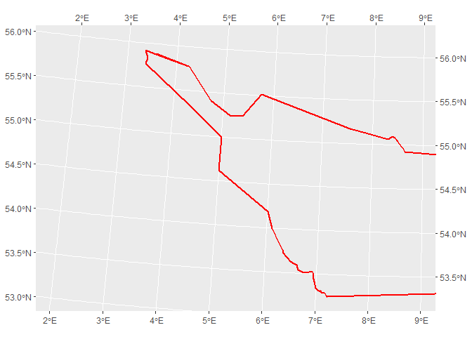

<!-- README.md is generated from README.Rmd. Please edit that file -->

# German North Sea

This package contains shapefiles from the **German North Sea**: <br>

-   [Natura2000](https://www.eea.europa.eu/data-and-maps/data/natura-13/natura-2000-spatial-data/natura-2000-shapefile-1)<br>
-   [Country shape](https://www.diva-gis.org/datadown)<br>
-   [Economic Exclusive
    zone](https://marineregions.org/gazetteer.php?p=details&id=5669)<br>
-   [ICES
    rectangles](https://gis.ices.dk/shapefiles/ICES_rectangles.zip)<br>

The goal is provide easy access to shapefiles of the North Sea

All shapefiles are in CRS 3035.

## Installation

``` r
# install.packages("devtools")
devtools::install_github("MiriamLL/GermanNorthSea")
```

``` r
library(GermanNorthSea)
```

# Data

### German Land

``` r
German_land<-GermanNorthSea::German_land
```

``` r
ggplot2::ggplot()+ ggplot2::geom_sf(data = German_land, colour = 'black', fill = '#ffffbe')+
  ggplot2::coord_sf(xlim = c(3790000,4250000), ylim = c(3350000,3680000),
                    label_axes = list(top = "E", left = "N", bottom = 'E', right='N'))
```


### German EEZ

``` r
German_EEZ<-GermanNorthSea::German_EEZ
```

``` r
ggplot2::ggplot()+ ggplot2::geom_sf(data = German_EEZ,
                                    colour = "red", fill= NA,alpha=0.9, lwd = 1)+
  ggplot2::coord_sf(xlim = c(3790000,4250000), ylim = c(3350000,3680000),
                    label_axes = list(top = "E", left = "N", bottom = 'E', right='N'))
```


### German Coast

``` r
German_coast<-GermanNorthSea::German_coast
```

``` r
ggplot2::ggplot()+ 
  ggplot2::geom_sf(data = German_coast, 
                                    colour = "red", fill= '#bde0fe',alpha=0.9, lwd = 1,linetype="dashed")+
  ggplot2::coord_sf(xlim = c(3790000,4250000), ylim = c(3350000,3680000),
                    label_axes = list(top = "E", left = "N", bottom = 'E', right='N'))
```



### German Natura 2000

``` r
German_natura<-GermanNorthSea::German_natura
```

``` r
ggplot2::ggplot()+ 
  ggplot2::geom_sf(data = German_natura, colour = "#3d6d22", fill= '#3d6d22',alpha=0.2, lwd = 1)+
  ggplot2::coord_sf(xlim = c(3790000,4250000), ylim = c(3350000,3680000),
                    label_axes = list(top = "E", left = "N", bottom = 'E', right='N'))
```


## ICES Rectangles

``` r
German_ICES<-GermanNorthSea::German_ICES
```

``` r
ggplot2::ggplot(German_ICES)+ 
  ggplot2::geom_sf(data = German_ICES, colour = "#3d6d22", fill= '#3d6d22',alpha=0.2, lwd = 1)+
  ggplot2::geom_sf_text(ggplot2::aes(label =ICESNAME),size=3,family="sans")+
  ggplot2::coord_sf(xlim = c(3790000,4250000), ylim = c(3350000,3680000),
                    label_axes = list(top = "E", left = "N", bottom = 'E', right='N'))
```

 \#
BATH

# Maps

``` r
library(ggplot2)
library(ggspatial)
#> Warning: package 'ggspatial' was built under R version 4.2.1
```

## German EEZ and land

``` r
ggplot() +
  geom_sf(data = German_EEZ, colour = "red", fill= NA,alpha=0.9, lwd = 0.5)+
  geom_sf(data = German_coast, colour = "red", fill= NA,alpha=0.9, lwd = 0.5,linetype="dashed")+
  geom_sf(data = German_land, colour = 'black', fill = '#ffffbe')+

  ggspatial::annotation_north_arrow(location ="bl", which_north = "true", 
        pad_x = unit(0.05, "in"), 
        pad_y = unit(0.05, "in"),
        
        style = north_arrow_fancy_orienteering)+
  
  theme(
  legend.spacing.y = unit(0.05, 'cm'),
  legend.text=element_text(size=10),
  legend.background = element_rect(fill='transparent',colour ="transparent"),
  legend.box.background = element_rect(fill='transparent',colour ="transparent"),
  legend.key = element_rect(fill = "transparent", colour = "transparent"),
  panel.background = element_rect(fill = '#bde0fe'))+
  
  xlab('Longitude')+ylab('Latitude')+
  
  theme(panel.border = element_rect(colour = "black", fill=NA, size=1.5))+
  
  ggplot2::coord_sf(xlim = c(3900000,4250000), ylim = c(3350000,3680000),
                    label_axes = list(top = "E", left = "N", bottom = 'E', right='N'))
```


## German Natura 2000

``` r
German_natura$Abbreviations<-c('SOR','BR','DB')
```

``` r
ggplot(German_natura) +
  geom_sf(data = German_EEZ, colour = "red", fill= NA,alpha=0.9, lwd = 0.5)+
  geom_sf(data = German_coast, colour = "red", fill= NA,alpha=0.9, lwd = 0.5,linetype="dashed")+
  geom_sf(data = German_land, colour = 'black', fill = '#ffffbe')+
  geom_sf(data = German_natura, colour = "#3d6d22", fill= '#3d6d22',alpha=0.2, lwd = 0.5)+
  geom_sf_text(aes(label=Abbreviations),size=3,family="sans")+
  
  annotation_north_arrow(location ="bl", which_north = "true", 
        pad_x = unit(0.05, "in"), 
        pad_y = unit(0.05, "in"),
        
        style = north_arrow_fancy_orienteering)+
  
  theme(
  legend.spacing.y = unit(0.05, 'cm'),
  legend.text=element_text(size=10),
  legend.background = element_rect(fill='transparent',colour ="transparent"),
  legend.box.background = element_rect(fill='transparent',colour ="transparent"),
  legend.key = element_rect(fill = "transparent", colour = "transparent"),
  panel.background = element_rect(fill = '#bde0fe'))+
  
  xlab('Longitude')+ylab('Latitude')+
  
  theme(panel.border = element_rect(colour = "black", fill=NA, size=1.5))+
  
  coord_sf(xlim = c(3900000,4250000), ylim = c(3350000,3680000),
                    label_axes = list(top = "E", left = "N", bottom = 'E', right='N'))
```


## ICES rectangles

``` r
library(tidyverse)
#> ── Attaching packages ─────────────────────────────────────── tidyverse 1.3.1 ──
#> ✔ tibble  3.1.7     ✔ dplyr   1.0.9
#> ✔ tidyr   1.2.0     ✔ stringr 1.4.0
#> ✔ readr   2.1.2     ✔ forcats 0.5.1
#> ✔ purrr   0.3.4
#> ── Conflicts ────────────────────────────────────────── tidyverse_conflicts() ──
#> ✖ dplyr::filter() masks stats::filter()
#> ✖ dplyr::lag()    masks stats::lag()
```

``` r
German_ICES<-GermanNorthSea::German_ICES
```

``` r
ICES_rectangles<-German_ICES %>%
  filter(ICESNAME %in% c('40F3','40F4',
                         '39F4','39F5','39F6','39F7','39F8',
                         '38F5','38F6','38F7','38F8',
                         '37F5','37F6','37F7','37F8',
                         '36F6','36F7','36F8'))
```

``` r
ggplot(ICES_rectangles)+ 
  geom_sf(data = ICES_rectangles, colour = "#14213d", fill= NA, alpha=0.2, lwd = 0.1)+
  geom_sf_text(aes(label=ICESNAME),size=3,family="sans")+

  geom_sf(data = German_EEZ, colour = "red", fill= NA,alpha=0.9, lwd = 0.5)+
  geom_sf(data = German_coast, colour = "red", fill= NA,alpha=0.9, lwd = 0.5,linetype="dashed")+
  geom_sf(data = German_natura, colour = "#3d6d22", fill= '#3d6d22',alpha=0.2, lwd = 0.5)+
  geom_sf(data = German_land, colour = 'black', fill = '#ffffbe')+

  ggspatial::annotation_north_arrow(location ="bl", which_north = "true", 
        pad_x = unit(0.05, "in"), 
        pad_y = unit(0.05, "in"),
        
        style = north_arrow_fancy_orienteering)+
  
  theme(
  legend.spacing.y = unit(0.05, 'cm'),
  legend.text=element_text(size=10),
  legend.background = element_rect(fill='transparent',colour ="transparent"),
  legend.box.background = element_rect(fill='transparent',colour ="transparent"),
  legend.key = element_rect(fill = "transparent", colour = "transparent"),
  panel.background = element_rect(fill = '#bde0fe'))+
  
  xlab('Longitude')+ylab('Latitude')+
  
  theme(panel.border = element_rect(colour = "black", fill=NA, size=1.5))+
  
  ggplot2::coord_sf(xlim = c(3900000,4250000), ylim = c(3350000,3680000),
                    label_axes = list(top = "E", left = "N", bottom = 'E', right='N'))
```


# Other CRS

For using other CRS, you can use the function **st_transform** from the
package **sf**.

``` r
library(sf)
#> Linking to GEOS 3.9.1, GDAL 3.3.2, PROJ 7.2.1; sf_use_s2() is TRUE
```

``` r
German_EEZ<-st_transform(German_EEZ, 4326)
German_coast<-st_transform(German_coast, 4326)
German_land<-st_transform(German_land, 4326)
German_natura<-st_transform(German_natura, 4326)
```

``` r
ggplot()+
  geom_sf(data = German_EEZ, colour = "red", fill= NA,alpha=0.9, lwd = 0.5)+
  geom_sf(data = German_coast, colour = "red", fill= NA,alpha=0.9, lwd = 0.5,linetype="dashed")+
  geom_sf(data = German_land, colour = 'black', fill = '#ffffbe')+
  geom_sf(data = German_natura, colour = "#3d6d22", fill= '#3d6d22',alpha=0.2, lwd = 0.5)+

  ggspatial::annotation_north_arrow(location ="bl", which_north = "true", 
        pad_x = unit(0.05, "in"), 
        pad_y = unit(0.05, "in"),
        
        style = north_arrow_fancy_orienteering)+
  
  theme(
  legend.spacing.y = unit(0.05, 'cm'),
  legend.text=element_text(size=10),
  legend.background = element_rect(fill='transparent',colour ="transparent"),
  legend.box.background = element_rect(fill='transparent',colour ="transparent"),
  legend.key = element_rect(fill = "transparent", colour = "transparent"),
  panel.background = element_rect(fill = '#bde0fe'))+
  
  xlab('Longitude')+ylab('Latitude')+
  
  theme(panel.border = element_rect(colour = "black", fill=NA, size=1.5))+
  
  coord_sf(xlim = c(3,9), ylim = c(53,56),
                    label_axes = list(top = "E", left = "N", bottom = 'E', right='N'))
```


# Other sources

-   [GEBCO](https://www.gebco.net/data_and_products/gridded_bathymetry_data/)
