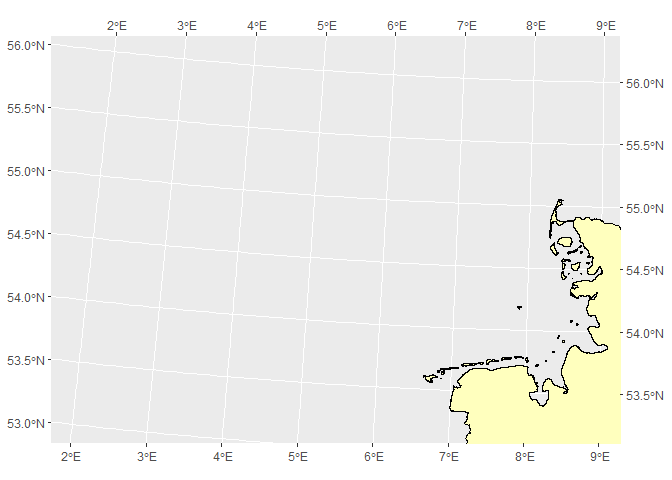
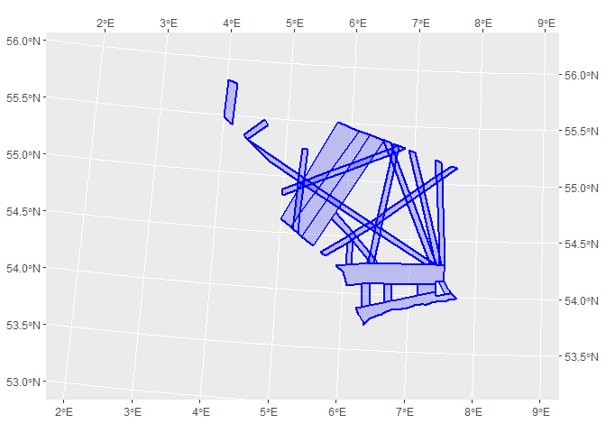

<!-- README.md is generated from README.Rmd. Please edit that file -->

# German North Sea

This package contains shapefiles from the **German North Sea**: <br>

- [Natura2000](https://www.eea.europa.eu/data-and-maps/data/natura-13/natura-2000-spatial-data/natura-2000-shapefile-1)<br>
- [Country shape](https://www.diva-gis.org/datadown)<br>
- [Economic Exclusive
  zone](https://marineregions.org/gazetteer.php?p=details&id=5669)<br>
- [ICES
  rectangles](https://gis.ices.dk/shapefiles/ICES_rectangles.zip)<br>

The goal is provide easy access to shapefiles of the North Sea

All shapefiles are in CRS 3035.

## Installation

``` r
# install.packages("devtools")
devtools::install_github("MiriamLL/GermanNorthSea")
```

``` r
library(GermanNorthSea)
```

# Data

## Base Maps

### German Land

To download go to: [DIVA-GIS](https://www.diva-gis.org/datadown)<br>
Select the country and Administrative areas.

``` r
Germany<-GermanNorthSea::Germany
```

``` r
ggplot2::ggplot()+ ggplot2::geom_sf(data = Germany, colour = 'black', fill = '#ffffbe')+
  ggplot2::coord_sf(xlim = c(3790000,4250000), ylim = c(3350000,3680000),
                    label_axes = list(top = "E", left = "N", bottom = 'E', right='N'))
```


### Europe

``` r
German_land<-GermanNorthSea::German_land
```

``` r
ggplot2::ggplot()+ ggplot2::geom_sf(data = German_land, colour = 'black', fill = '#ffffbe')+
  ggplot2::coord_sf(xlim = c(3790000,4250000), ylim = c(3350000,3680000),
                    label_axes = list(top = "E", left = "N", bottom = 'E', right='N'))
```



### German EEZ

To download: go to
[EMODnet](https://www.emodnet-humanactivities.eu/view-data.php)\>Select
wind farms in the map. Select Other Forms of Area
Management/Designation\>Click on the download icon on [Exclusive
Economic
Zone](https://www.emodnet-humanactivities.eu/search-results.php?dataname=Exclusive+Economic+Zone).
Select Download Data, Select the country, and the Sector, and the Link
should be ready to download.

``` r
German_EEZ<-GermanNorthSea::German_EEZ
```

``` r
ggplot2::ggplot()+ ggplot2::geom_sf(data = German_EEZ,
                                    colour = "red", fill= NA,alpha=0.9, lwd = 1)+
  ggplot2::coord_sf(xlim = c(3790000,4250000), ylim = c(3350000,3680000),
                    label_axes = list(top = "E", left = "N", bottom = 'E', right='N'))
```


### German Coast

``` r
German_coast<-GermanNorthSea::German_coast
```

``` r
ggplot2::ggplot()+ 
  ggplot2::geom_sf(data = German_coast, 
                                    colour = "red", fill= '#bde0fe',alpha=0.9, lwd = 1,linetype="dashed")+
  ggplot2::coord_sf(xlim = c(3790000,4250000), ylim = c(3350000,3680000),
                    label_axes = list(top = "E", left = "N", bottom = 'E', right='N'))
```


### ICES Rectangles

Source: [ICES rectangles](https://gis.ices.dk/sf/index.html)<br> To
download: go to link\> click on **Quick Downloads**\> select ICES
Statistical Rectangles.

``` r
German_ICES<-GermanNorthSea::German_ICES
```

``` r
ggplot2::ggplot(German_ICES)+ 
  ggplot2::geom_sf(data = German_ICES, colour = "#3d6d22", fill= '#3d6d22',alpha=0.2, lwd = 1)+
  ggplot2::geom_sf_text(ggplot2::aes(label =ICESNAME),size=3,family="sans")+
  ggplot2::coord_sf(xlim = c(3790000,4250000), ylim = c(3350000,3680000),
                    label_axes = list(top = "E", left = "N", bottom = 'E', right='N'))
```


### German Natura 2000

To download: go to
[GeoSeaPortal](https://www.geoseaportal.de/atomfeeds/Raumordnungsplan_AWZ_en.xml#download=1.)
The zip contains several shapefiles including **NatureConservation**

Other option is
[eea](https://www.eea.europa.eu/data-and-maps/data/natura-13)

``` r
German_natura<-GermanNorthSea::German_natura
```

``` r
ggplot2::ggplot()+ 
  ggplot2::geom_sf(data = German_natura, colour = "#3d6d22", fill= '#3d6d22',alpha=0.2, lwd = 1)+
  ggplot2::coord_sf(xlim = c(3790000,4250000), ylim = c(3350000,3680000),
                    label_axes = list(top = "E", left = "N", bottom = 'E', right='N'))
```


Other option is [Europen Environment
Agency](https://www.eea.europa.eu/data-and-maps/data/natura-14) This
file contains a more complete data from the natura 2000 sites.

For using the SCA (Special Conservation Areas) in Germany

``` r
German_SCA<-GermanNorthSea::German_SCA
```

``` r
ggplot2::ggplot()+ 
  ggplot2::geom_sf(data = German_SCA, colour = "#3d6d22", fill= '#3d6d22',alpha=0.2, lwd = 1)+
  ggplot2::coord_sf(xlim = c(3790000,4250000), ylim = c(3350000,3680000),
                    label_axes = list(top = "E", left = "N", bottom = 'E', right='N'))
```


## Using both SPA and SCA

``` r
ggplot2::ggplot()+ 
  ggplot2::geom_sf(data = German_natura, colour = "#3d6d22", fill= '#3d6d22',alpha=0.2, lwd = 1)+
  ggplot2::geom_sf(data = German_SCA, colour = "#3d6d22", fill= '#3d6d22',alpha=0.2, lwd = 1)+
  ggplot2::coord_sf(xlim = c(3790000,4250000), ylim = c(3350000,3680000),
                    label_axes = list(top = "E", left = "N", bottom = 'E', right='N'))
```


## Human activities

### Shipping lines

To download: go to
[GeoSeaPortal](https://www.geoseaportal.de/atomfeeds/Raumordnungsplan_AWZ_en.xml#download=1.)
The zip contains several shapefiles including **Shipping**

``` r
German_Shipping<-GermanNorthSea::German_Shipping
```

``` r
ggplot2::ggplot()+ 
  ggplot2::geom_sf(data = German_Shipping, colour = "blue", fill= 'blue',alpha=0.2, lwd = 1)+
  ggplot2::coord_sf(xlim = c(3790000,4250000), ylim = c(3350000,3680000),
                    label_axes = list(top = "E", left = "N", bottom = 'E', right='N'))
```


### Wind Farms

#### BfN

To download: go to
[GeoSeaPortal](https://www.geoseaportal.de/atomfeeds/Raumordnungsplan_AWZ_en.xml#download=1.)
The zip contains several shapefiles including **‘OffshoreWindEnergy’**

``` r
German_OWF<-GermanNorthSea::German_OWF
```

``` r
ggplot2::ggplot()+ 
  ggplot2::geom_sf(data = German_OWF, colour = "#fe0001", fill= '#bde0fe',alpha=0.9, size=1)+
  ggplot2::coord_sf(xlim = c(3790000,4250000), ylim = c(3350000,3680000),
                    label_axes = list(top = "E", left = "N", bottom = 'E', right='N'))
```


#### EMODnet

To download: Go to
[EMBO](https://www.emodnet-humanactivities.eu/view-data.php). Select
[human
activities](https://www.emodnet-humanactivities.eu/search-results.php?dataname=Wind+Farms+%28Polygons%29)

``` r
OWF_EMODnet<-GermanNorthSea::OWF_EMODnet
```

``` r
ggplot2::ggplot()+ 
  ggplot2::geom_sf(data = OWF_EMODnet, colour = "#fe0001", fill= '#bde0fe',alpha=0.9, size=1)+
  ggplot2::coord_sf(xlim = c(3790000,4250000), ylim = c(3350000,3680000),
                    label_axes = list(top = "E", left = "N", bottom = 'E', right='N'))
```



# Maps

``` r
library(ggplot2)
#> Warning: package 'ggplot2' was built under R version 4.2.3
library(ggspatial)
```

## Base Maps

``` r
German_land<-GermanNorthSea::German_land
German_EEZ<-GermanNorthSea::German_EEZ
German_coast<-GermanNorthSea::German_coast
```

``` r
ggplot() +
  geom_sf(data = German_EEZ, colour = "red", fill= NA,alpha=0.9, lwd = 0.5)+
  geom_sf(data = German_coast, colour = "red", fill= NA,alpha=0.9, lwd = 0.5,linetype="dashed")+
  geom_sf(data = German_land, colour = 'black', fill = '#ffffbe')+

  annotation_north_arrow(location ="bl", which_north = "true", 
        pad_x = unit(0.05, "in"), 
        pad_y = unit(0.05, "in"),
        
        style = north_arrow_fancy_orienteering)+
  
  theme(
  legend.spacing.y = unit(0.05, 'cm'),
  legend.text=element_text(size=10),
  legend.background = element_rect(fill='transparent',colour ="transparent"),
  legend.box.background = element_rect(fill='transparent',colour ="transparent"),
  legend.key = element_rect(fill = "transparent", colour = "transparent"),
  panel.background = element_rect(fill = '#bde0fe'))+
  
  xlab('Longitude')+ylab('Latitude')+
  
  theme(panel.border = element_rect(colour = "black", fill=NA, size=1.5))+
  
  coord_sf(xlim = c(3900000,4250000), ylim = c(3350000,3680000),
                    label_axes = list(top = "E", left = "N", bottom = 'E', right='N'))
#> Warning: The `size` argument of `element_rect()` is deprecated as of ggplot2 3.4.0.
#> ℹ Please use the `linewidth` argument instead.
#> This warning is displayed once every 8 hours.
#> Call `lifecycle::last_lifecycle_warnings()` to see where this warning was
#> generated.
```


### ICES rectangles

``` r
library(tidyverse)
#> Warning: package 'tidyverse' was built under R version 4.2.3
#> Warning: package 'tibble' was built under R version 4.2.3
#> Warning: package 'readr' was built under R version 4.2.3
#> Warning: package 'dplyr' was built under R version 4.2.3
#> Warning: package 'forcats' was built under R version 4.2.3
#> Warning: package 'lubridate' was built under R version 4.2.3
```

``` r
German_ICES<-GermanNorthSea::German_ICES
```

``` r
ICES_rectangles<-German_ICES %>%
  filter(ICESNAME %in% c('40F3','40F4',
                         '39F4','39F5','39F6','39F7','39F8',
                         '38F5','38F6','38F7','38F8',
                         '37F5','37F6','37F7','37F8',
                         '36F6','36F7','36F8'))
```

``` r
ggplot(ICES_rectangles)+ 
  geom_sf(data = ICES_rectangles, colour = "#14213d", fill= NA, alpha=0.2, lwd = 0.1)+
  geom_sf_text(aes(label=ICESNAME),size=3,family="sans")+

  geom_sf(data = German_EEZ, colour = "red", fill= NA,alpha=0.9, lwd = 0.5)+
  geom_sf(data = German_coast, colour = "red", fill= NA,alpha=0.9, lwd = 0.5,linetype="dashed")+
  geom_sf(data = German_land, colour = 'black', fill = '#ffffbe')+

  annotation_north_arrow(location ="bl", which_north = "true", 
        pad_x = unit(0.05, "in"), 
        pad_y = unit(0.05, "in"),
        
        style = north_arrow_fancy_orienteering)+
  
  theme(
  legend.spacing.y = unit(0.05, 'cm'),
  legend.text=element_text(size=10),
  legend.background = element_rect(fill='transparent',colour ="transparent"),
  legend.box.background = element_rect(fill='transparent',colour ="transparent"),
  legend.key = element_rect(fill = "transparent", colour = "transparent"),
  panel.background = element_rect(fill = '#bde0fe'))+
  
  xlab('Longitude')+ylab('Latitude')+
  
  theme(panel.border = element_rect(colour = "black", fill=NA, size=1.5))+
  
  coord_sf(xlim = c(3900000,4250000), ylim = c(3350000,3680000),
                    label_axes = list(top = "E", left = "N", bottom = 'E', right='N'))
```


## Protected areas

``` r
German_natura<-GermanNorthSea::German_natura
```

``` r
German_natura$Abbreviations<-c('SOR','BR','DB')
```

``` r
ggplot(German_natura) +
  geom_sf(data = German_EEZ, colour = "red", fill= NA,alpha=0.9, lwd = 0.5)+
  geom_sf(data = German_coast, colour = "red", fill= NA,alpha=0.9, lwd = 0.5,linetype="dashed")+
  geom_sf(data = German_land, colour = 'black', fill = '#ffffbe')+
  geom_sf(data = German_natura, colour = "#3d6d22", fill= '#3d6d22',alpha=0.2, lwd = 0.5)+
  geom_sf_text(aes(label=Abbreviations),size=3,family="sans")+
  
  annotation_north_arrow(location ="bl", which_north = "true", 
        pad_x = unit(0.05, "in"), 
        pad_y = unit(0.05, "in"),
        
        style = north_arrow_fancy_orienteering)+
  
  theme(
  legend.spacing.y = unit(0.05, 'cm'),
  legend.text=element_text(size=10),
  legend.background = element_rect(fill='transparent',colour ="transparent"),
  legend.box.background = element_rect(fill='transparent',colour ="transparent"),
  legend.key = element_rect(fill = "transparent", colour = "transparent"),
  panel.background = element_rect(fill = '#bde0fe'))+
  
  xlab('Longitude')+ylab('Latitude')+
  
  theme(panel.border = element_rect(colour = "black", fill=NA, size=1.5))+
  
  coord_sf(xlim = c(3900000,4250000), ylim = c(3350000,3680000),
                    label_axes = list(top = "E", left = "N", bottom = 'E', right='N'))
```


## Human activities

### Wind Farms

``` r
OWF_EMODnet<-GermanNorthSea::OWF_EMODnet
```

``` r
ggplot(OWF_EMODnet)+ 
  geom_sf(data = German_EEZ,colour = "red", fill= NA,alpha=0.9, lwd = 0.5)+
  geom_sf(data = German_coast,colour = "red", fill= '#bde0fe',alpha=0.9, lwd = 0.5,linetype="dashed")+
  geom_sf(data = German_land, colour = 'black', fill = '#ffffbe')+
  geom_sf(data = German_natura, colour = "#3d6d22", fill= '#3d6d22',alpha=0.2, lwd = 0.5)+
  geom_sf(data = OWF_EMODnet, aes(fill= STATUS), colour = "grey",alpha=0.9, size=0.5)+
  scale_fill_manual(values = c("yellow", "blue", "green"))+
  coord_sf(xlim = c(3790000,4250000), ylim = c(3350000,3680000),
                    label_axes = list(top = "E", left = "N", bottom = 'E', right='N'))+
  theme(legend.position = 'bottom')
```


### Shipping lines

``` r
German_Shipping<-GermanNorthSea::German_Shipping
```

``` r
ggplot(German_Shipping)+ 
  geom_sf(data = German_EEZ,colour = "red", fill= NA,alpha=0.9, lwd = 0.5)+
  geom_sf(data = German_coast,colour = "red", fill= '#bde0fe',alpha=0.9, lwd = 0.5,linetype="dashed")+
  geom_sf(data = German_land, colour = 'black', fill = '#ffffbe')+
  geom_sf(data = German_natura, colour = "#3d6d22", fill= '#3d6d22',alpha=0.2, lwd = 0.5)+
  geom_sf(data = German_Shipping, aes(fill= Type), colour = "grey",alpha=0.9, size=0.5)+
  scale_fill_manual(values = c("blue", "deepskyblue", "turquoise"))+
  coord_sf(xlim = c(3790000,4250000), ylim = c(3350000,3680000),
                    label_axes = list(top = "E", left = "N", bottom = 'E', right='N'))+
  theme(legend.position = 'bottom')
```


### Shipping intensity

# Other CRS

For using other CRS, you can use the function **st_transform** from the
package **sf**.

``` r
library(sf)
#> Linking to GEOS 3.9.3, GDAL 3.5.2, PROJ 8.2.1; sf_use_s2() is TRUE
```

``` r
German_EEZ<-st_transform(German_EEZ, 4326)
German_coast<-st_transform(German_coast, 4326)
German_land<-st_transform(German_land, 4326)
German_natura<-st_transform(German_natura, 4326)
```

``` r
ggplot()+
  geom_sf(data = German_EEZ, colour = "red", fill= NA,alpha=0.9, lwd = 0.5)+
  geom_sf(data = German_coast, colour = "red", fill= NA,alpha=0.9, lwd = 0.5,linetype="dashed")+
  geom_sf(data = German_land, colour = 'black', fill = '#ffffbe')+
  geom_sf(data = German_natura, colour = "#3d6d22", fill= '#3d6d22',alpha=0.2, lwd = 0.5)+

  ggspatial::annotation_north_arrow(location ="bl", which_north = "true", 
        pad_x = unit(0.05, "in"), 
        pad_y = unit(0.05, "in"),
        
        style = north_arrow_fancy_orienteering)+
  
  theme(
  legend.spacing.y = unit(0.05, 'cm'),
  legend.text=element_text(size=10),
  legend.background = element_rect(fill='transparent',colour ="transparent"),
  legend.box.background = element_rect(fill='transparent',colour ="transparent"),
  legend.key = element_rect(fill = "transparent", colour = "transparent"),
  panel.background = element_rect(fill = '#bde0fe'))+
  
  xlab('Longitude')+ylab('Latitude')+
  
  theme(panel.border = element_rect(colour = "black", fill=NA, size=1.5))+
  
  coord_sf(xlim = c(3,9), ylim = c(53,56),
                    label_axes = list(top = "E", left = "N", bottom = 'E', right='N'))
```


# Other sources

- [Marine Spatial
  Planning](https://www.bsh.de/EN/TOPICS/Offshore/Maritime_spatial_planning/maritime_spatial_planning_node.html)

- [Shipping
  intensity](https://www.emodnet-humanactivities.eu/download-data.php)

- [Marine
  Traffic](https://www.marinetraffic.com/en/ais/home/centerx:8.6/centery:53.9/zoom:9)

- [Offshore wind farms](https://map.4coffshore.com/offshorewind/)

- [Windkraftanlagen](https://commons.wikimedia.org/wiki/File:Karte_Offshore-Windkraftanlagen_in_der_Deutschen_Bucht.png)

- [GEBCO](https://www.gebco.net/data_and_products/gridded_bathymetry_data/)

- [NOAA-GRIDDAP-GLOBAL](https://erddap.ifremer.fr/erddap/griddap/index.html?page=1&itemsPerPage=1000)

- [COPERNICUS](https://resources.marine.copernicus.eu/products)
